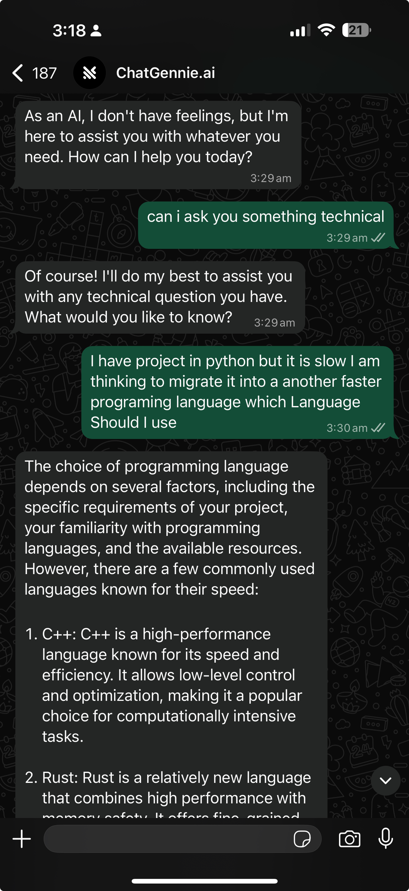

# ChatGPT WhatsApp Bot

A Node.js application that integrates OpenAI's ChatGPT with WhatsApp through Twilio, allowing users to interact with AI directly through WhatsApp messages with subscription-based token management.



## Features

- 🤖 **AI-Powered Conversations**: Interact with OpenAI's GPT model through WhatsApp
- 📱 **WhatsApp Integration**: Seamless messaging through Twilio's WhatsApp API
- 💳 **Subscription Management**: Token-based usage with subscription tiers
- 🔒 **Secure Configuration**: Environment-based configuration for API keys
- 📊 **Session Tracking**: Track message counts per user session

## How It Works

### 1. Message Flow
1. User sends a WhatsApp message to your Twilio number
2. Twilio forwards the message to your webhook endpoint (`/sms`)
3. The bot checks the user's subscription status
4. Based on subscription status, the bot either:
   - Processes the message with ChatGPT
   - Prompts for subscription/token setup
   - Requests subscription upgrade

### 2. Subscription States

#### New User (No Subscription)
- User receives: "Please give me your required tokens"
- User sends a number to set their token limit
- System creates subscription with specified tokens

#### Inactive Subscription
- User receives: "You don't have an active subscription. Please visit our website to view our plans"

#### Active Subscription
- Message is sent to OpenAI's GPT model
- Response is generated using user's available tokens
- Reply is sent back through WhatsApp

### 3. Architecture

```
WhatsApp User → Twilio → Your Server → Subscription API
                    ↓
              OpenAI GPT API → Response → WhatsApp User
```

## Setup Instructions

### Prerequisites
- Node.js (v14 or higher)
- Twilio account with WhatsApp sandbox or approved number
- OpenAI API account
- Subscription management API (or modify code for direct database)

### Installation

1. **Clone the repository**
   ```bash
   git clone <repository-url>
   cd chatgpt-whatsapp-bot
   ```

2. **Install dependencies**
   ```bash
   npm install
   ```

3. **Environment Configuration**
   
   Create a `.env` file in the root directory:
   ```env
   # OpenAI Configuration
   OPENAI_API_KEY=your_openai_api_key_here
   OPENAI_ORGANIZATION=your_openai_org_id_here
   
   # Subscription API
   SUBSCRIPTION_API_URL=https://chatgpt.talhasultan.dev/api/subscriptions
   
   # Database Configuration (for future MySQL integration)
   MYSQL_HOST=localhost
   MYSQL_USER=your_mysql_user
   MYSQL_PASS=your_mysql_password
   MYSQL_DB=chatgpt
   
   # Server Configuration
   PORT=3000
   ```

4. **Twilio Webhook Setup**
   - Set your Twilio webhook URL to: `https://yourdomain.com/sms`
   - Ensure your server is accessible via HTTPS (use ngrok for local development)

### Running the Application

**Development**
```bash
npm start
```

**Production**
```bash
node server.js
```

The server will start on port 3000 (or your specified PORT).

## API Endpoints

### `GET /`
Health check endpoint that returns "Running............"

### `POST /sms`
Main webhook endpoint for processing WhatsApp messages from Twilio.

**Expected Request Body:**
- `From`: User's phone number (Twilio format)
- `Body`: Message content from user

## Database Schema

For future MySQL integration, create a database named `chatgpt` with a `subscription` table:

```sql
CREATE DATABASE chatgpt;
USE chatgpt;

CREATE TABLE subscription (
    id INT AUTO_INCREMENT PRIMARY KEY,
    contact_no VARCHAR(20) NOT NULL,
    sub INT NOT NULL,
    tokens INT NOT NULL,
    created_at TIMESTAMP DEFAULT CURRENT_TIMESTAMP
);
```

## Configuration Details

### OpenAI Settings
- **Model**: `text-davinci-003`
- **Temperature**: `0` (for consistent responses)
- **Max Tokens**: Based on user's subscription limit

### Subscription Tiers
- `-1`: New user (token selection required)
- `0`: Inactive subscription
- `7`: Active subscription (configurable)

## Development Notes

### Security Considerations
- All sensitive data is stored in environment variables
- `.env` file is gitignored to prevent accidental commits
- Session management for tracking user interactions

### Error Handling
- Basic error handling for API failures
- Graceful degradation for subscription API issues
- Console logging for debugging

## Deployment

### Using Heroku
1. Create a new Heroku app
2. Set environment variables in Heroku dashboard
3. Deploy using Git or GitHub integration

### Using Railway/Render
1. Connect your repository
2. Configure environment variables
3. Deploy with automatic builds

### Using VPS
1. Clone repository to your server
2. Install Node.js and dependencies
3. Configure environment variables
4. Use PM2 or similar for process management
5. Set up reverse proxy (nginx) for HTTPS

## Contributing

1. Fork the repository
2. Create a feature branch
3. Make your changes
4. Test thoroughly
5. Submit a pull request

## License

MIT License - see [LICENSE](LICENSE) file for details.

## Support

For issues and questions:
1. Check the console logs for error messages
2. Verify all environment variables are set correctly
3. Ensure Twilio webhook is properly configured
4. Test OpenAI API connectivity independently

## Roadmap

- [ ] Direct MySQL integration
- [ ] Enhanced error handling
- [ ] Rate limiting implementation
- [ ] Multiple AI model support
- [ ] Admin dashboard for subscription management
- [ ] Usage analytics and reporting